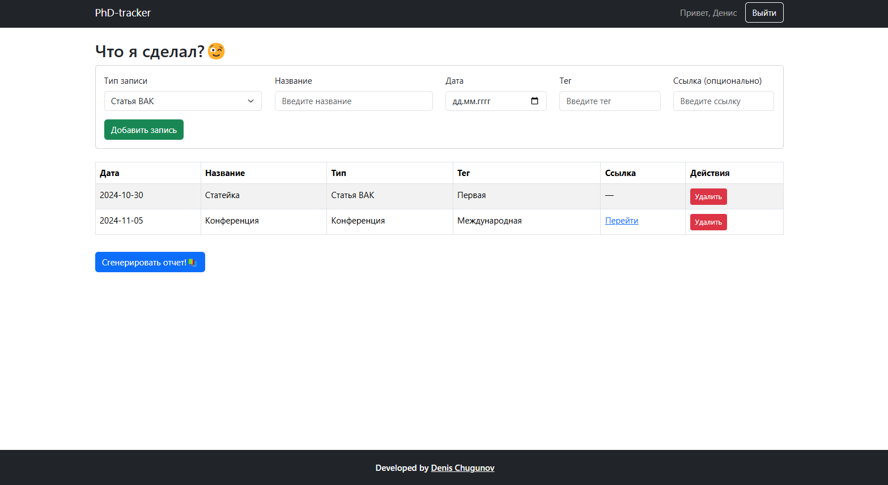

# PhD-tracker

## Описание проекта
PhD-tracker — это приложение, разработанное для аспирантов, которое помогает систематизировать научные труды, разделяя их по категориям (статьи, статьи ВАК, конференции). Приложение позволяет хранить данные локально, а также предоставляет возможность скачивания данных в формате **docx** для использования в отчетах.

## Функционал
- **Добавление записей**: создавайте записи с указанием названия, типа, даты, тегов и ссылок.
- **Категоризация**: сортируйте записи по категориям (статьи, статьи ВАК, конференции).
- **Сохранение данных**: все данные сохраняются в локальном хранилище.
- **Экспорт в Word**: генерация и скачивание таблицы данных в формате **docx**.
- **Авторизация через Google Firebase**: возможность входа в приложение через аккаунт Google.

## Используемые технологии
- **React**: для разработки пользовательского интерфейса.
- **Redux Toolkit**: для управления состоянием приложения.
- **React Router**: для маршрутизации страниц.
- **Firebase**: для авторизации через Google.
- **Bootstrap**: для стилизации приложения.
- **Библиотеки для экспорта данных**: использованы сторонние библиотеки для создания документов и их скачивания.

## Скриншот приложения

## Попробовать приложение
[Ссылка на приложение](https://phdtracker-4c028.web.app/)

## Автор
Разработано **Denis Chugunov**.